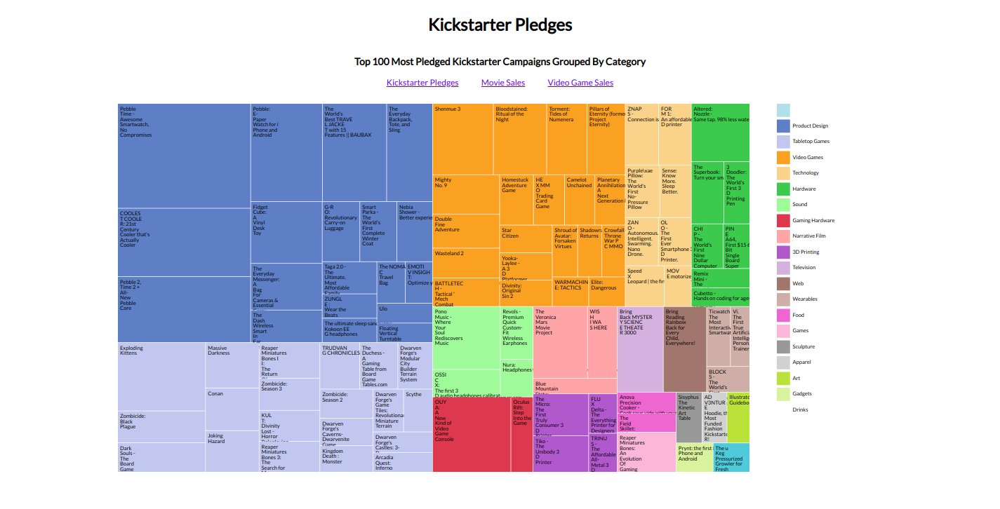

# Treemap Diagram

## Introduction
This treemap diagram shows the top 100 most pledged Kickstarter campaigns and groups them by their category.

Treemaps quickly give an overview of the data sizes and how they compare to each other. The data blocks are generated in relation to their actual sizes.

This treemap diagram is made with [D3](https://d3js.org/).

This project is part of freeCodeCamps Data Visualization certificate.

## Project Requirements
* The chart should have a title with a corresponding id="title".
* The chart should have a g element x-axis with a corresponding id="x-axis".
* The chart should have a g element y-axis with a corresponding id="y-axis".
* Both axes should contain multiple tick labels, each with the corresponding class="tick".
* The chart should have a rect element for each data point with a corresponding class="bar" displaying the data.
* Each bar should have the properties data-date and data-gdp containing date and GDP values.
* The bar elements' data-date properties should match the order of the provided data.
* The bar elements' data-gdp properties should match the order of the provided data.
* Each bar element's height should accurately represent the data's corresponding GDP.
* The data-date attribute and its corresponding bar element should align with the corresponding value on the x-axis.
* The data-gdp attribute and its corresponding bar element should align with the corresponding value on the y-axis.
* Moving the mouse over an area shows a tooltip with a corresponding id="tooltip" which displays more information about the area.
* The tooltip should have a data-date property that corresponds to the data-date of the active area.

## Project Data
Kickstarter campaigns:  
https://raw.githubusercontent.com/freeCodeCamp/ProjectReferenceData/master/GDP-data.json

## Final Project
https://myrmidonut.github.io/fcc_dataviz_treemap_diagram

## Preview Images
### Main Screen:

